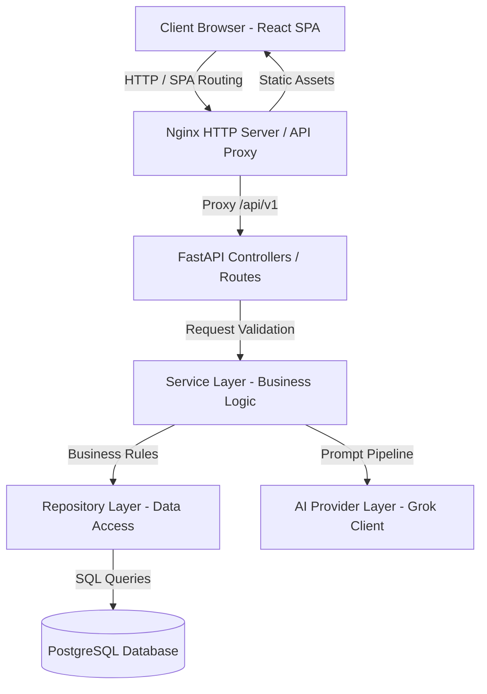
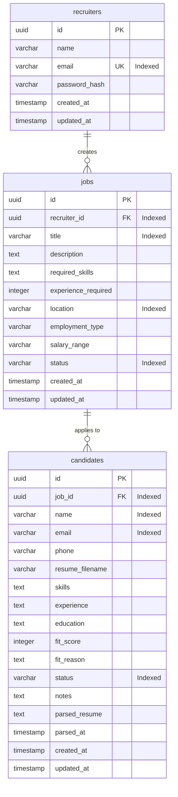
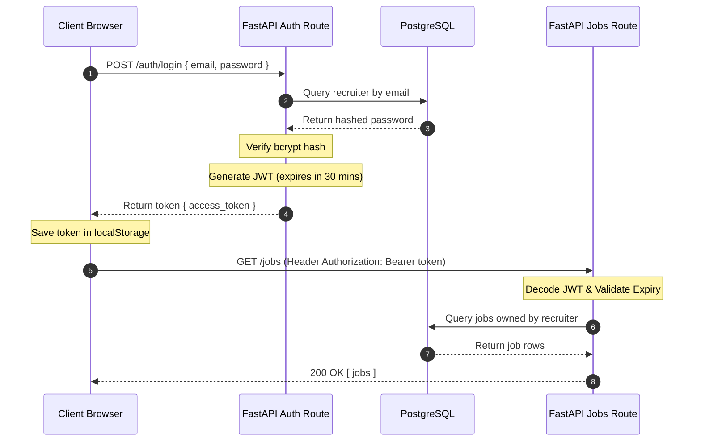
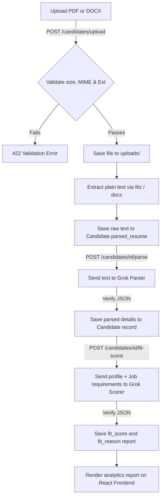

# Gappeo Recruiter Management System

An AI-powered recruitment management platform designed to help recruiters publish jobs, manage candidate application profiles, upload resume documents, parse profile details using Grok Cloud AI, and generate candidate-job fit score reports.

---

## 1. Project Overview

### Purpose
Streamline candidate application parsing and matching. Recruiters can post jobs, manage applicant lists, securely upload resume files, parse applicant details automatically using AI, and obtain candidate-job fit scoring metrics with strengths, gaps, and hiring recommendations.

### Assignment Goal
Deliver a secure, high-performance, containerized, and deployable pre-production recruitment SaaS foundation using Clean Architecture principles.

### Key Features
- **Job Board**: Create, edit, list, close, and delete job openings with specific skills and experience requirements.
- **Candidate Profiles**: Add and manage candidate profiles mapped to job openings.
- **Document Management**: Securely upload and process PDF and DOCX resumes up to 5MB.
- **AI Text Parsing**: Extract plain text (via PyMuPDF and python-docx) and parse structured fields using Grok AI.
- **AI Fit Assessment**: Compare candidate profiles with job listings to output a numeric match score (0-100), key strengths, gaps, and a summary recommendation.
- **Analytics Dashboard**: Interactive recruiter summary view showing KPIs (total postings, match averages, highest fit scores) and recent activities.

### Technology Stack
- **Backend API**: Python 3.12, FastAPI, Uvicorn
- **Database Layer**: PostgreSQL 16, SQLAlchemy 2.x
- **Schema Validation**: Pydantic v2
- **Database Migrations**: Alembic
- **Authentication**: JWT (python-jose), Password Hashing (bcrypt)
- **Frontend App**: React 18, TypeScript, Vite, SPA routing
- **AI Engine**: Grok Cloud API (`gpt-oss-120b`)
- **Hosting / Server**: Nginx Alpine
- **Deployment**: Docker, Docker Compose

---

## 2. System Architecture

The application implements a strict **Clean Architecture** boundary, separating concerns into discrete modules:



### Architectural Principles
- **API Controllers**: Contain no database queries or business rules; they validate inputs and call services.
- **Service Layer**: Coordinates business transactions and ownership validations.
- **Repository Layer**: Encapsulates all SQL execution, safeguarding DB schemas from leaks.
- **AI Layer**: Swappable provider client interface, allowing Grok Cloud, OpenAI, or local sandboxes to be plugged in seamlessly.

---

## 3. Folder Structure

```
├── backend/
│   ├── alembic/                # DB schema migrations versioning
│   ├── app/
│   │   ├── api/v1/             # API Router definitions
│   │   │   ├── auth/           # Login & Registration endpoints
│   │   │   ├── jobs/           # Job board operations
│   │   │   ├── candidates/     # Candidate & Resume endpoints
│   │   │   ├── dashboard/      # Metrics and analytics endpoints
│   │   │   ├── health.py       # Container readiness probes
│   │   │   └── router.py       # Route aggregator
│   │   ├── ai/                 # Grok & Sandbox AI clients
│   │   ├── config/             # Pydantic Settings env loader
│   │   ├── core/               # Global loggers, exceptions, JWT guards
│   │   ├── database/           # Engines, session factories
│   │   ├── dependencies/       # Security & DB injections
│   │   ├── middleware/         # Security headers, timing, error handlers
│   │   ├── models/             # SQLAlchemy DB schemas
│   │   ├── repositories/       # Parameterized data access layers
│   │   ├── services/           # Core business logic handlers
│   │   └── utils/              # PDF/DOCX extractors
│   ├── tests/                  # Pytest unit & integration suite
│   ├── Dockerfile              # Backend container build instructions
│   └── requirements.txt        # Backend dependencies manifest
├── frontend/
│   ├── src/
│   │   ├── components/         # Reusable HTML5 widgets
│   │   ├── hooks/              # Custom React state hooks
│   │   ├── pages/              # SPA route page views
│   │   ├── services/           # REST API client wrappers
│   │   ├── styles/             # Modular CSS stylesheet definitions
│   │   ├── types/              # Type declarations
│   │   ├── App.tsx             # Root route mapper
│   │   └── main.tsx            # Main React mount
│   ├── Dockerfile              # Multi-stage production Nginx Dockerfile
│   ├── nginx.conf              # Nginx proxy and compression configurations
│   └── package.json            # NPM build package manifest
├── docker-compose.yml          # DevOps orchestration file
├── .env.example                # Template configuration values
├── .gitignore                  # Git build file exclusions
└── README.md                   # Technical platform documentation
```

---

## 4. Installation & Quick Start

### Prerequisites
- Docker & Docker Compose installed.

### Quick Start
```bash
# 1. Clone repository
git clone <repository-url>
cd "Gappeo Recruiter"

# 2. Copy template environment configurations
cp .env.example .env

# 3. Boot database, backend API, and frontend server
docker-compose up --build -d

# 4. Apply database migration schemas
docker-compose exec backend alembic upgrade head
```

### Access URLs
- **React Frontend**: `http://localhost:3000`
- **Swagger Documentation**: `http://localhost:8000/docs`
- **Readiness Probes**: `http://localhost:8000/api/v1/health/ready`

---

## 5. API Documentation

All REST responses return standardized JSON envelopes. Authorized endpoints require `Authorization: Bearer <JWT_TOKEN>`.

### Authentication
- `POST /api/v1/auth/register` (No Auth): Create a recruiter account.
- `POST /api/v1/auth/login` (No Auth): Login and receive JWT access token.
- `GET /api/v1/auth/me` (Auth): Fetch current recruiter profile.

### Jobs
- `POST /api/v1/jobs` (Auth): Publish a job opening.
- `GET /api/v1/jobs` (Auth): List and filter job postings (paginated).
- `GET /api/v1/jobs/{id}` (Auth): Get job details.
- `PUT /api/v1/jobs/{id}` (Auth): Edit job posting (blocked if status is CLOSED).
- `DELETE /api/v1/jobs/{id}` (Auth): Delete job opening.
- `PATCH /api/v1/jobs/{id}/close` (Auth): Close job posting.

### Candidates
- `POST /api/v1/candidates` (Auth): Register candidate application profile.
- `GET /api/v1/candidates` (Auth): List and search candidates (paginated).
- `GET /api/v1/candidates/{id}` (Auth): Get candidate profile.
- `PUT /api/v1/candidates/{id}` (Auth): Edit profile details.
- `DELETE /api/v1/candidates/{id}` (Auth): Delete candidate application.

### Resume Upload & AI
- `POST /api/v1/candidates/upload` (Auth): Upload multipart resume PDF/DOCX (Max 5MB).
- `POST /api/v1/candidates/{id}/parse` (Auth): Parse resume text using Grok AI.
- `POST /api/v1/candidates/{id}/fit-score` (Auth): Generate candidate match score.
- `GET /api/v1/candidates/{id}/parsed` (Auth): Fetch candidate parsed data.

---

## 6. Database Design

We use a normalized PostgreSQL database schema with indexes and cascading deletions:



---

## 7. Authentication Flow

Authentication is managed via stateless JWT tokens stored in the browser's `localStorage`:



---

## 8. AI Text & Fit Score Pipeline



---

## 9. Engineering Decisions

### Why FastAPI?
FastAPI is built on ASGI (Starlette) for high-concurrency async execution, parses requests using Pydantic, and auto-generates Swagger schemas, minimizing boilerplate.

### Why PostgreSQL & SQLAlchemy?
PostgreSQL provides ACID transactions, UUID keys, and robust indexes. SQLAlchemy 2.0 acts as a modern, type-safe ORM supporting async connections and lazy/eager relationship loading.

### Why Repository & Service Layer Patterns?
- **Repository**: Isolates SQL logic. Swapping databases or updating queries requires zero changes to route handlers or business logic.
- **Service Layer**: Centralizes business transactions. Validating applicant ownership or job-posting statuses resides in services, making the application modular and testable.

### Why Grok Cloud & `gpt-oss-120b`?
Grok Cloud offers OpenAI-compatible HTTP endpoints. The `gpt-oss-120b` model supports strict JSON output schemas, low latency, and handles unstructured candidate files efficiently.

---

## 10. Security Hardening

- **Secure HTTP Headers**: Configured `SecurityHeadersMiddleware` enforcing:
  - `X-Frame-Options: DENY` (Mitigates clickjacking).
  - `X-Content-Type-Options: nosniff` (Mitigates MIME sniffing).
  - `Strict-Transport-Security` (Enforces HTTPS).
  - `Content-Security-Policy` (Restricts code injections).
- **MIME & Extension Enforcement**: Multipart uploads strictly validate binary content type. Rejecting ZIP, RAR, TXT, images, or executables protects the system.
- **Path Traversal Protection**: Upload paths are resolved to absolute paths, verifying they remain inside the `uploads/` folder.
- **Non-Privileged Container Execution**: Backend runs under a non-root system user `gappeo` inside Docker to prevent privilege escalation.

---

## 11. Performance Optimization

- **Indexes**: Added B-tree indexes on lookup fields: `recruiter_id`, `job_id`, `email`, `status`, `name`, and `title`.
- **Eager Loading**: Configured relationship properties to select related records with minimal queries, avoiding database N+1 performance issues.
- **Static Assets Serving**: Frontend container uses Nginx Alpine for high-speed HTML/JS asset transmission with gzip compression.

---

## 12. Scalability & Future Architecture

1. **Stateless Operations**: Session states are not saved on the backend. This allows scaling horizontal backend nodes behind load balancers (e.g. AWS ALB).
2. **Cloud Object Storage (S3/MinIO)**: Upload helper files can be easily swapped for S3 client libraries to store resumes externally without refactoring routes.
3. **Queue Processing**: Heavy AI workloads can be pushed to background task runners (e.g. Celery with Redis) to keep HTTP responses immediate and prevent timeouts.

---

## 13. Future Improvements

- **Bulk Resume Upload**: Drag-and-drop folders of documents to parse candidates in batches.
- **Interview Scheduling**: Connect recruiter calendars (Google/Outlook) to schedule meetings.
- **Email Notifications**: Alert applicants when status updates from Active to Hired.
- **Audit Logging**: Trace recruiter actions (job deletions, status changes) for enterprise compliance.

---

## 14. Screenshots Placeholders

- **Login**: `[login_screenshot_placeholder]`
- **Dashboard**: `[dashboard_screenshot_placeholder]`
- **Jobs Board**: `[jobs_screenshot_placeholder]`
- **Candidates Board**: `[candidates_screenshot_placeholder]`
- **Upload Details**: `[upload_screenshot_placeholder]`
- **AI Fit Score Report**: `[fit_score_screenshot_placeholder]`

---

## License
Private — All rights reserved.
